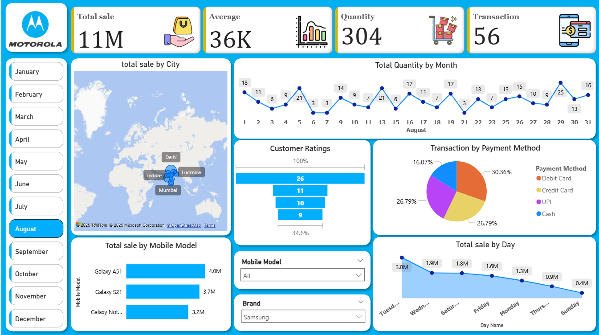

# Motorola-Dashboard
The Motorola Sales Dashboard is an interactive Power BI project designed to provide a comprehensive view of sales performance, customer behavior, and product trends. The dashboard visually represents sales data across different cities, mobile models, payment methods, and time periods, enabling business stakeholders to make informed decisions.
# 📱 Motorola Sales Dashboard - Power BI Project

The **Motorola Sales Dashboard** is an interactive **Power BI** project designed to provide a comprehensive view of sales performance, customer behavior, and product trends. The dashboard visually represents sales data across different cities, mobile models, payment methods, and time periods, enabling business stakeholders to make informed decisions.

---

## 📊 Key Highlights

- **KPI Summary**
  - **Total Sales**: ₹11M
  - **Average Sale**: ₹36K
  - **Total Quantity Sold**: 304 units
  - **Total Transactions**: 56

- **Geographic Analysis**
  - Map visualization showing total sales by city (Delhi, Mumbai, Indore, Lucknow).

- **Time-based Trends**
  - Total quantity sold by date within August.
  - Total sales by day of the week, showing peak and low sales days.

- **Customer Insights**
  - Customer ratings distribution to evaluate satisfaction levels.

- **Payment Method Breakdown**
  - Percentage of sales by Debit Card, Credit Card, UPI, and Cash.

- **Product Analysis**
  - Total sales by mobile model (e.g., Galaxy A51, Galaxy S21, Galaxy Note).

---

## 🛠 Tools & Techniques Used
- **Power BI** – for building interactive dashboards.
- **Power Query** – for data cleaning and transformation.
- **Custom Visuals** – for clear representation of KPIs and sales trends.
- **Interactive Filters & Slicers** – for month, brand, and model-based analysis.

---

## 💡 Potential Enhancements
- Include year-over-year comparisons.
- Add profit and margin analysis.
- Segment customers by purchase frequency and loyalty.

---

## 📷 Screenshot

---

This **Motorola Sales Dashboard** offers a clear, visual understanding of sales data, helping decision-makers identify trends, evaluate performance, and plan business strategies effectively.
